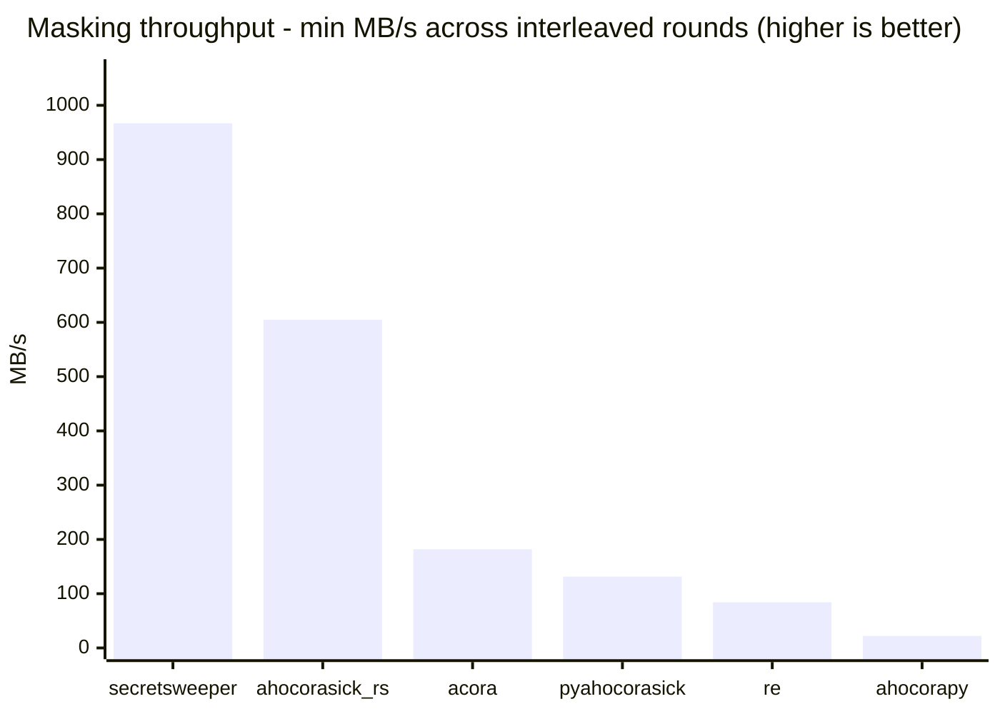

# SecretSweeper Masking Benchmark

Compares `secretsweeper.mask()` against stdlib `re` and several Aho-Corasick libraries on a synthetic corpus containing sparse, realistic secrets. Generated by [`bench.py`](bench.py) + [`report.py`](report.py) - re-run with:

```bash
uv run --group benchmark python benchmarks/gen_corpus.py
uv run --group benchmark python benchmarks/bench.py --rounds 5
uv run --group benchmark python benchmarks/report.py
```

## Machine

| | |
|---|---|
| CPU | Apple M1 Pro |
| Cores | 10 physical / 10 logical |
| Memory | 32.0 GiB |
| OS | Darwin 25.6.0 (arm64) |
| Python | CPython 3.14.6 |
| Zig | 0.16.0 |
| secretsweeper | 0.1.0 |

## Corpus

~100.01 MiB of synthetic log lines / Terraform-plan-style noise, seeded with 13 realistic secrets (AWS/GitHub/Slack/Stripe/JWT/DB-URL/OAuth-style, 61-957 bytes) and 4 fake PEM blocks (OPENSSH PRIVATE KEY, EC PRIVATE KEY, RSA PRIVATE KEY, CERTIFICATE, 1035-1278 bytes) at random positions - same absolute secret count regardless of corpus size, so secrets stay sparse (closer to real-world rarity than scaling secret count with file size). Fixed seed (20260731): every regeneration is byte-identical.

## Results

Each engine measured as a single total wall-clock call (build/compile + search + mask fused, no separate breakdown) over 5 interleaved rounds (engine order rotates each round to spread out system noise). Non-native engines only find match spans, so each gets the same handwritten pure-Python reconstruction (merge overlapping spans, cap at 15 stars) counted in its total; secretsweeper's Zig core fuses search+mask natively. `correct` checks byte-identical output against secretsweeper's own result.



| Engine | min | avg | min throughput | vs. fastest | correct |
|---|---:|---:|---:|---:|:---:|
| secretsweeper `0.1.0` | 108.5 ms | 123.1 ms | 966.9 MB/s | 1.00x | ✅ |
| ahocorasick_rs `1.0.3` | 173.4 ms | 175.0 ms | 604.8 MB/s | 1.60x | ✅ |
| acora `2.5` | 576.3 ms | 585.4 ms | 182.0 MB/s | 5.31x | ✅ |
| pyahocorasick `2.3.1` | 797.7 ms | 837.5 ms | 131.5 MB/s | 7.36x | ✅ |
| re (stdlib regex) `python 3.14.6` | 1245.7 ms | 1255.7 ms | 84.2 MB/s | 11.49x | ✅ |
| ahocorapy (pure python) `1.8.0` | 4721.5 ms | 4813.3 ms | 22.2 MB/s | 43.53x | ✅ |

## Notes

- **Pattern set size vs. the DFA path.** secretsweeper dispatches through a byte-class-compressed DFA when the pattern set fits `Aho.DFA_MEMORY_CAP` (currently **20 MiB**, `src/aho.zig`), falling back to a classic trie/fail-link walk otherwise - both are correct, but the DFA is usually faster for small-to-moderate pattern sets. This run's 17 patterns (~10.0 KiB total) comfortably fit under the cap, so this benchmark exercises the DFA path specifically. A much larger or more numerous pattern set can exceed the cap and fall back - re-run against your own patterns if that distinction matters for your use case.
- **This corpus is a best case for the bigram gate.** The DFA dispatch skips a byte entirely (no `dfa_table`/`dfa_match` lookup at all) whenever it's at the root and the next two bytes provably can't start any pattern - a large win when matches are sparse (this corpus: real matches roughly every ~370 bytes), since most of the file never leaves the root state. Corpora with frequent or back-to-back matches spend less time at the root and benefit less (verified: no regression on an all-matching synthetic corpus, only reduced upside).
- **Rebuild before re-running after a source change.** An editable install (`pip install -e .`) can leave a stale compiled library sitting in the `secretsweeper/` source directory that shadows a freshly rebuilt one in site-packages. After changing anything under `src/`, run `uv pip install -e . --reinstall` and, if in doubt, copy `zig-out/lib/{libsecretsweeper.dylib or .so,_native.abi3.so}` into `secretsweeper/` directly before benchmarking - otherwise you may be measuring an old build without realizing it.
- **Single-machine, single-run numbers.** These are wall-clock measurements on one machine at one point in time (see **Machine**, above) - thermal throttling, background load, and machine-to-machine variance are all real. Treat cross-run deltas smaller than ~10-15% as noise unless reproduced across multiple separate invocations.

